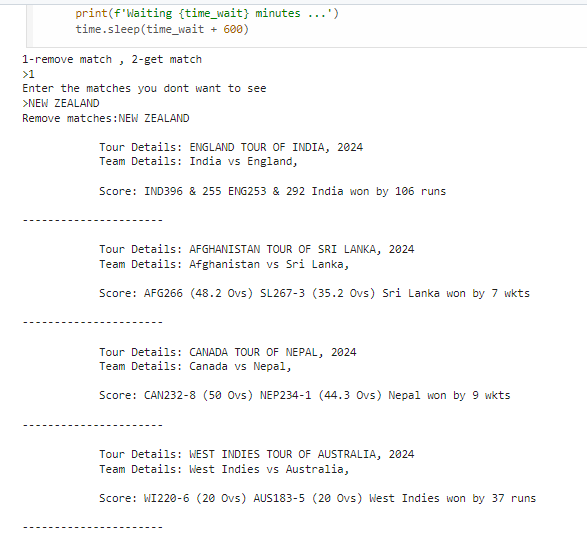
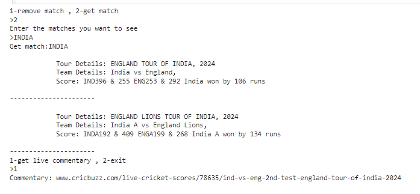
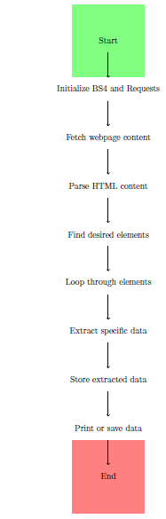

# Obtaining live cricket scores from Cricbuzz using webscraping 

This project aims to scrape data from the Cricbuzz website, specifically match details, team details, score, result, and commentary for live matches. It also selects a particular team to view the results indiviually and removes a particular team from the result. The extracted data is then printed to the console.

# Final Result

The script will print the extracted data for each live match to the console. The output will be similar to the following:

For Filter match option 

For Select match option

# Workflow Diagram 

The workflow diagram displayed below demonstrates how to use webscraping to obtain live cricket scores from Cricbuzz.

# Features

* Scrapes data from the Cricbuzz live scores page.
* Extracts tour details, team details, score,result and commentary for each match.
* Select a particular team to view the results indiviually.
* Remove a particular team from the result
* Prints the extracted data to the console.

# Article

The project has been published as an article in Medium, to which the link is provided below.

                      https://medium.com/@vasudevanswornampillai/unlocking-the-secrets-of-live-cricket-scores-a-web-scraping-adventure-with-beautifulsoup-and-e4ef4db0fcdf

# Requirements

* Python 3.x
* BeautifulSoup4 library
* Requests library

# Installation

1. Install the required libraries using pip:

             pip install beautifulsoup4 requests

3. Clone the project repository:

             git clone https://github.com/your-username/cricbuzz-web-scraping.git

# Usage

1. Navigate to the project directory:

             cd cricbuzz-web-scraping

2. Run the following script:

             python get_selected_match.py

# Tech Stack

 **Language** - Python 3.10.12

# Share with the community

If you find this project interesting or helpful, don't hesitate to share with your community! Let's learn and grow together! 

# Conclusion 

In this project, we’ve developed a robust solution for Digitizing catalogue. The model, a beacon of performance, awaits those go into the beautiful world of Python.
